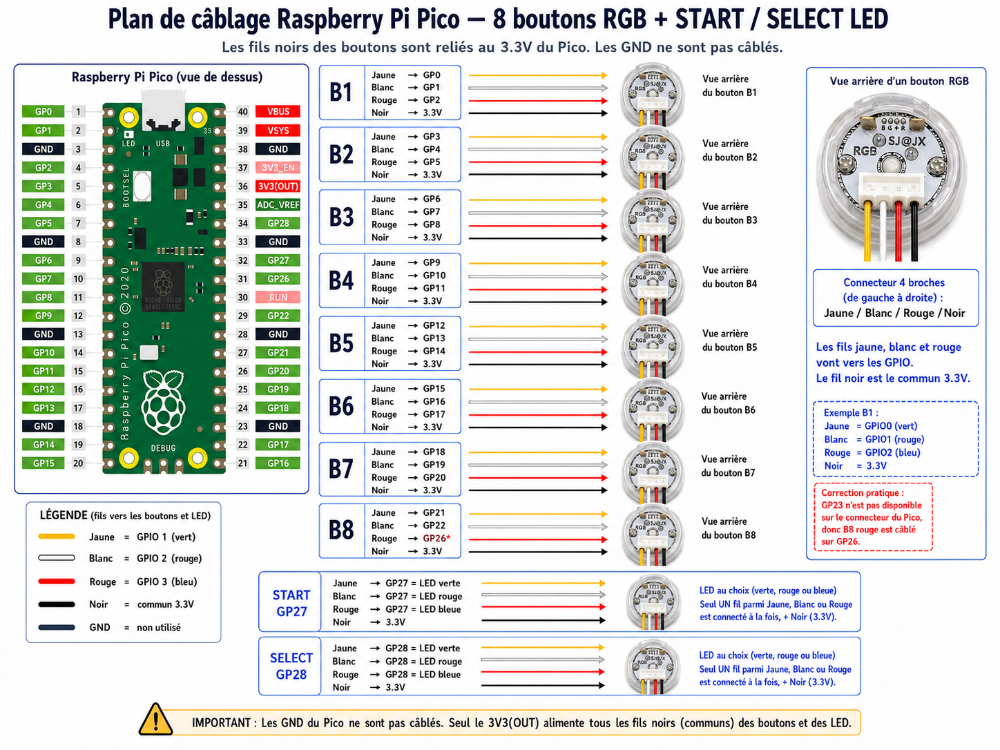
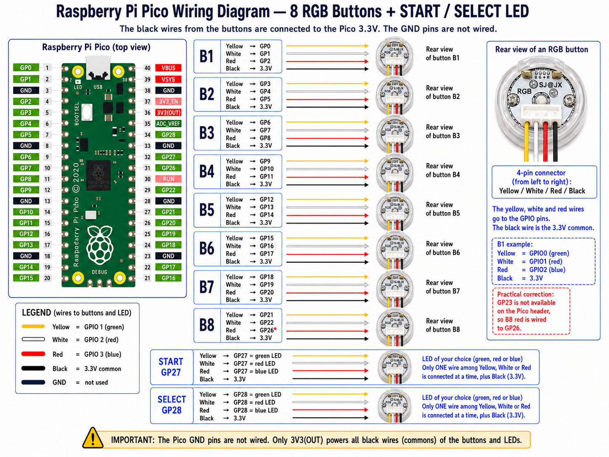

# Guide de Câblage et de Configuration du Raspberry Pi Pico

Ce document décrit l'installation du firmware, le schéma de câblage et la configuration matérielle pour piloter vos dalles ou boutons LED RGB avec le **Raspberry Pi Pico** et le plug-in **LedManager**.

---

## 1. Installation du Firmware sur le Pico

Le Raspberry Pi Pico fonctionne avec un firmware écrit en **MicroPython**. Pour l'installer :

1.  **Téléchargez MicroPython** : Récupérez le dernier fichier `.uf2` stable pour Raspberry Pi Pico sur le site officiel de MicroPython.
2.  **Flashez le Pico** : Maintenez le bouton `BOOTSEL` enfoncé tout en branchant le Pico en USB à votre ordinateur. Un lecteur réseau nommé `RPI-RP2` apparaît. Copiez le fichier `.uf2` dessus. Le Pico redémarre automatiquement.
3.  **Déploiement automatique des fichiers du firmware** :
    Un script d'installation automatisé est disponible dans le dossier `tools/` de ce dépôt pour transférer automatiquement les scripts du firmware (`fw/main.py`, `fw/hardware_profiles.py`, `fw/profiles_db.py`) vers votre Pico.
    
    Pour l'utiliser, ouvrez une console PowerShell dans le dossier de LedManager et exécutez la commande suivante :
    ```powershell
    powershell -ExecutionPolicy Bypass -File .\tools\deploy-pico-fw.ps1 -Port COM3
    ```
    *(Remplacez `COM3` par le port COM virtuel affecté à votre Pico).*
    
    Vous pouvez également utiliser un éditeur de code tel que **Thonny** pour téléverser manuellement le contenu du dossier `fw/` à la racine de votre Pico.
4.  Le Pico est prêt à recevoir les commandes série envoyées par `PicoCommandSender.exe`.

---

## 2. Schéma de Câblage Matériel

Voici les recommandations de câblage standard pour connecter vos boutons d'arcade (contacts secs) et votre bandeau/dalle de LED adressables (type WS2812B / NeoPixel) :

### Description des Connexions
*   **Bandeau LED WS2812B** :
    *   `DIN` (Donnée) -> Relié au port de sortie de donnée du Pico (par défaut **GP0**).
    *   `5V / VCC` -> Relié à l'alimentation 5V externe (partager le pôle positif avec la broche `VBUS` du Pico si alimenté via USB).
    *   `GND` -> Relié à une broche `GND` du Pico (très important pour le signal de données) ainsi qu'à la borne négative de l'alimentation 5V.
*   **Boutons d'Arcade (LEDs simples ou RGB)** :
    *   Chaque couleur ou bouton simple est branché à une broche `GPx` (GPIO) du Pico.
    *   Le retour commun de la LED/du bouton va à la masse (`GND`).

### Schémas techniques de câblage

#### Version Française :


#### English Version :


---

## 3. Configuration de `PicoCommandSender.ini`

L'utilitaire `PicoCommandSender.exe` lit sa configuration depuis `PicoCommandSender.ini` pour initialiser le matériel à chaque lancement. Vous devez déclarer vos boutons et broches GPIO dans ce fichier.

### Section `[Hardware:<sender>]`
Définit la nature des contrôleurs :
```ini
[Hardware:P1]
PanelButtons=8            ; Nombre de boutons principaux
PanelButtonType=RGBLED     ; Type de LED (RGBLED pour LED RGB classique, ADDRLED pour adressable)
Start=LED                  ; Type pour le bouton START (LED simple ou RGBLED)
Select=LED                 ; Type pour le bouton SELECT (LED simple ou RGBLED)
Joystick1=NONE             ; NONE si pas de LED dans le joystick, RGBLED sinon
OnOffInvert=true           ; Inverse l'état logique si nécessaire (selon câblage anode/cathode commune)
```

### Section `[GPIO:<sender>]`
Mappe les slots logiques aux broches physiques du Pico. 
*   Pour des **LED simples** (START, SELECT), renseignez une seule broche GPIO.
*   Pour des **LED RGB**, renseignez les broches correspondantes au format `Rouge,Vert,Bleu`.

```ini
[GPIO:P1]
B1=0,1,2                  ; Bouton 1 câblé sur GP0 (R), GP1 (V), GP2 (B)
B2=3,4,5                  ; Bouton 2 câblé sur GP3, GP4, GP5
B3=6,7,8
B4=9,10,11
B5=12,13,14
B6=15,16,17
B7=18,19,20
B8=21,22,23
START=27                  ; Bouton Start câblé sur GP27 (LED simple)
SELECT=28                 ; Bouton Select câblé sur GP28 (LED simple)
```

### Section `[Serial]`
Permet à `PicoCommandSender.exe` de localiser et d'initialiser le port COM virtuel du Pico :
```ini
[Serial]
Port=COM3                 ; Remplacez par le port COM assigné à votre Pico sous Windows
BaudRate=115200
Transport=PowerShellBridge
BridgeScript=tools\serial-bridge.ps1
```
