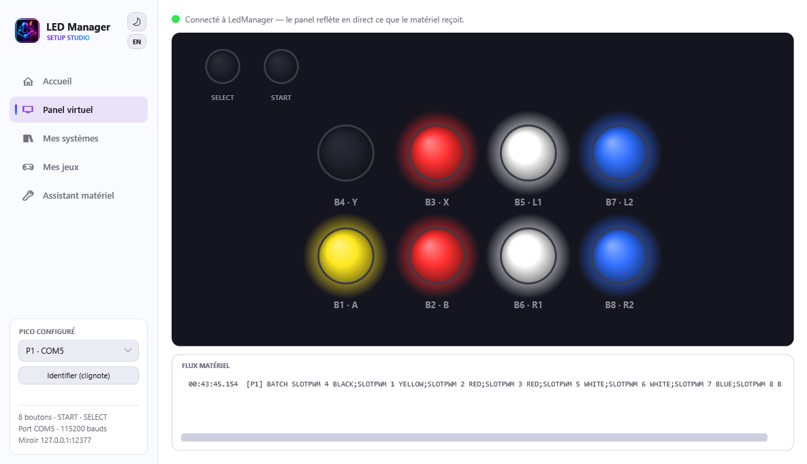
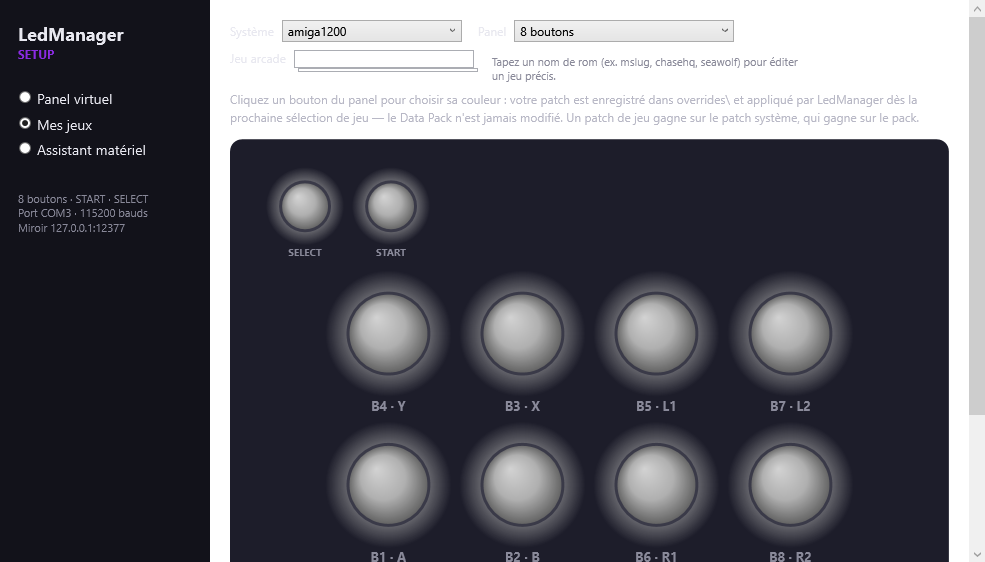
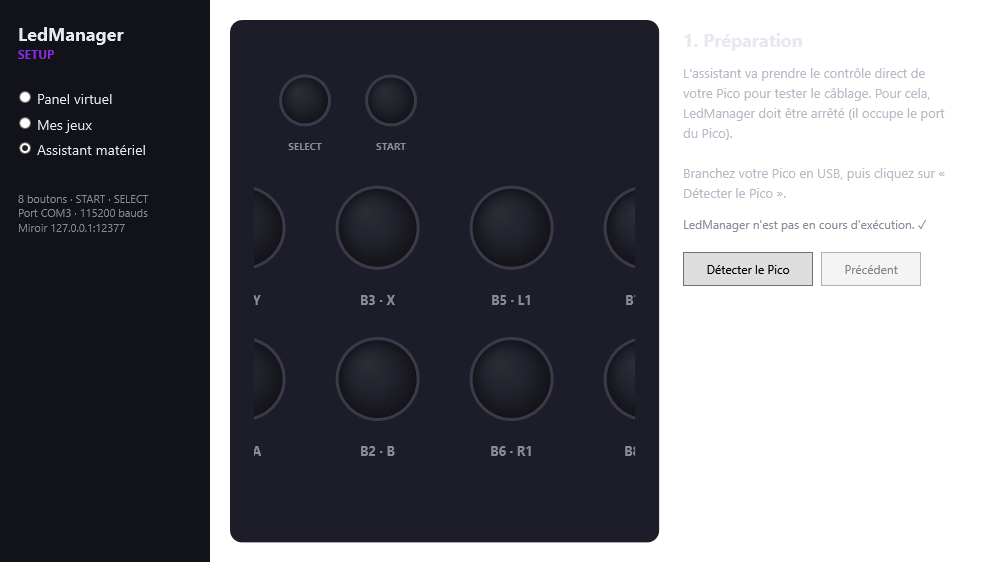

# The setup assistant

`LedManagerSetup.exe`, at the root of the plugin, is the visual tool that guides you from wiring to going live — without editing a single file by hand.

It offers two modes in the sidebar:

- **Virtual panel**: a real-time mirror of your panel. While LedManager is running (in a game or the menus), it shows exactly the colors sent to your LEDs. Great to check everything reacts, or to debug without staring at the cabinet.
- **Hardware assistant**: the guided flow to configure and test your Pico.

!!! note "French or English"
    The tool follows RetroBat's language (EmulationStation setting), else Windows'. To force it: `LedManagerSetup.exe --lang fr` or `--lang en`.

## The virtual panel

Open `LedManagerSetup.exe` while RetroBat is running: the dot turns green and the virtual panel animates in sync with the real one. It shows the [recommended standard arrangement](materiel.md#the-standard-arrangement-recommended-for-retrobat) (SELECT/START top-left, then the two rows).

!!! note "A slight in-game slowdown is normal"
    The tool runs at low priority so it doesn't disturb emulation, but keep it closed during serious play — it's a tuning tool.

## My games: customize the colors

The **My games** tab shows each system's panel as the pack defines it (see [Per-system panels](systemes.md)), and lets you repaint it: click a button, pick its color from the firmware palette (19 colors), save. Your customization is written as a **sparse patch** to `overrides\systems\<system>.json` — the pack is never modified, and LedManager applies the patch from the next game selection, no restart needed.

- The **Panel** selector is a preview: 2/4/6/8 buttons and historical variants (Score Master, Fighting Stick…). The override applies to the whole system.
- **Arcade game**: type a rom name (mslug, chasehq, seawolf…) to edit one specific game among the 3280 curated ones — the displayed panel is exactly what the runtime resolves (pack + system patch), and your paint is written to `overrides\games\<system>\<rom>.json`, which beats the system patch.
- **"Original color"** in the palette removes a button's override; **"Back to pack colors"** deletes the whole patch.
- **"Test on the real panel"** stops LedManager for the duration and sends your colors to the Pico: they follow your clicks live on the real buttons.

## The hardware assistant

The assistant takes **direct control** of your Pico to test it. Since LedManager holds the Pico's port, the assistant stops it automatically when the test starts (your LEDs go dark during configuration — that's normal).

### 1. Preparation

Plug your Pico in over USB (a **data** cable, not a charge-only one), then click **Detect the Pico**. The assistant:

- stops LedManager to free the port;
- searches the serial ports for your Pico and reads its firmware version;
- restarts the driver and lights the whole panel white.

If nothing is detected: check the cable, and that the [firmware is installed](materiel.md#flashing-the-firmware).

### 2. Panel test

Your buttons should all be **lit white**. That confirms power and firmware work. If some stay dark, it's a wiring or power issue (see [Troubleshooting](depannage.md)).

### 3. Color test

The assistant lights each channel in turn: the whole panel in red, then green, then blue. The virtual panel shows the expected color; if the real panel shows something else (the R/G/B wires got crossed during assembly), report the color you actually see.

The assistant deduces the real wire order and **fixes the channel order in the configuration** — no re-soldering. The test then re-runs to confirm.

### 4. Wiring test

This is the clever step: one button lights up **green** on your real panel, one at a time. Each time, **click the virtual button that matches** the one lit for real. A cyan blink confirms your click, both on screen and on the panel.

START and SELECT are tested at the end of the sequence.

The assistant thus compares your real wiring to the expected arrangement. If differences show up (two swapped wires, say), the **"Fix automatically"** button rewrites the software wiring (`[GPIO:P1]` in `PicoCommandSender.ini`, with a `.bak` backup) so every button answers at its place — nothing to dismantle. The test re-runs to confirm.

### 5. Save the configuration

Once everything matches, **"Save the configuration"** writes into `PicoCommandSender.ini` what the assistant verified on your hardware: the COM port that answered, the panel composition (button count, START/SELECT), and an initialization delay **measured** on your Pico instead of the conservative shipped default — LedManager starts that much faster.
