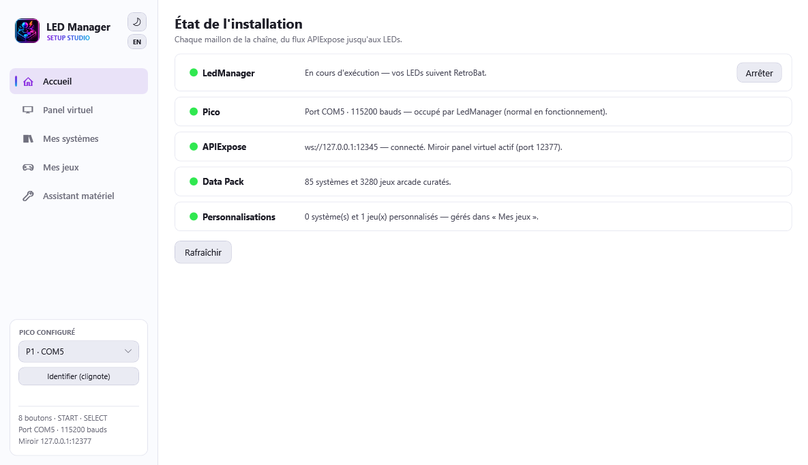

# L'assistant de configuration

`LedManagerSetup.exe`, à la racine du plugin, est l'outil visuel qui vous accompagne du branchement à la mise en service - sans éditer un seul fichier à la main.

Il propose deux modes, dans la barre latérale :

- **Panel virtuel** : un miroir en temps réel de votre panneau. Quand LedManager tourne (en jeu ou dans les menus), il affiche exactement les couleurs envoyées à vos LEDs. Idéal pour vérifier que tout réagit, ou déboguer sans avoir les yeux sur la borne.
- **Assistant matériel** : le parcours guidé pour configurer et tester votre Pico.

!!! note "Français ou anglais"
    L'outil s'affiche dans la langue de RetroBat (réglage EmulationStation), sinon celle de Windows. Pour forcer : `LedManagerSetup.exe --lang fr` ou `--lang en`.

## L'accueil : état de l'installation

L'onglet d'ouverture vérifie chaque maillon de la chaîne : LedManager (avec boutons Démarrer/Arrêter), le Pico (port configuré, détection à la demande quand LedManager est arrêté), APIExpose et le miroir du panel virtuel, le Data Pack (systèmes et jeux curatés disponibles) et vos personnalisations. Un maillon rouge = le point à régler en premier.

## Le panel virtuel

Ouvrez `LedManagerSetup.exe` pendant que RetroBat tourne : la pastille devient verte et le panneau virtuel s'anime en même temps que le vrai. Vous y retrouvez la [disposition standard conseillée](materiel.md#la-disposition-standard-conseillee-pour-retrobat) (SELECT/START en haut à gauche, puis les deux rangées).

!!! note "Un léger ralentissement en jeu est normal"
    L'outil tourne en priorité basse pour ne pas gêner l'émulation, mais gardez-le fermé pendant vos parties sérieuses - c'est un outil de réglage.

## Mes jeux : personnaliser les couleurs

L'onglet **Mes jeux** affiche le panel de chaque système tel que le pack le définit (voir [Panels par système](systemes.md)), et vous laisse **modifier sa configuration LED** : cliquez un bouton, choisissez sa couleur dans la palette du firmware (19 couleurs), enregistrez. Votre configuration est écrite en **patch épars** dans `overrides\systems\<système>.json` - le pack n'est jamais modifié, et LedManager applique le patch dès la prochaine sélection de jeu, sans redémarrage.

- Le sélecteur **Panel** sert d'aperçu : 2/4/6/8 boutons et variantes historiques (Score Master, Fighting Stick…). L'override s'applique au système entier.
- **Jeu arcade** : tapez un nom de rom (mslug, chasehq, seawolf…) pour éditer un jeu précis parmi les 3280 **jeux arcade curatés** (les seuls avec une configuration LED par jeu ; leurs médias vivent dans `media\systems\arcade`). Le panel affiché est exactement celui que le runtime résout (pack + patch système), et votre configuration LED est écrite dans `overrides\games\arcade\<rom>.json` - prioritaire sur le patch système. LedManager accepte indifféremment `arcade` et `mame` comme nom de dossier.
- **Jeux console** : pas de configuration LED par jeu dans le pack - personnalisez au niveau du système. Un patch par jeu console reste possible à la main dans `overrides\games\<système>\<rom>.json` (ex. `games\snes\smw.json`, même format), le runtime l'applique.
- **« Couleur d'origine »** dans la palette retire l'override d'un bouton ; **« Revenir aux couleurs du pack »** supprime tout le patch.
- **« Tester sur le panneau réel »** arrête LedManager le temps du test et envoie vos couleurs au Pico : elles suivent vos clics en direct sur les vrais boutons.

## L'assistant matériel

L'assistant prend le **contrôle direct** de votre Pico pour le tester. Comme LedManager occupe le port du Pico, l'assistant l'arrête automatiquement au démarrage du test (vos LEDs s'éteignent le temps de la configuration, c'est normal).

### 1. Préparation

Branchez votre Pico en USB (câble **data**, pas un câble de charge seul), puis cliquez **Détecter le Pico**. L'assistant :

- arrête LedManager pour libérer le port ;
- cherche votre Pico sur les ports série et lit sa version de firmware ;
- relance le pilote et allume tout le panneau en blanc.

Si rien n'est détecté, le bouton **« Installer le firmware »** apparaît : l'assistant dépose lui-même le firmware du panel sur le Pico (par la liaison série MicroPython), puis relance la détection. Pour un Pico **neuf** (jamais flashé), branchez-le en maintenant le bouton BOOTSEL : l'assistant vous guide pour déposer MicroPython une première fois (copie automatique si un fichier `.uf2` est présent dans `fw\`), puis installe le firmware du panel. Vérifiez aussi le câble USB (data, pas charge seule) - détails dans [Matériel](materiel.md#flasher-le-firmware).

Avant de lancer, choisissez l'**étendue** du test : **Test complet** (tout le parcours), **Juste le test LED** (refaire seulement le câblage des LEDs, étape 4) ou **Juste la cartographie** (refaire seulement les entrées, étape 5). Pratique pour ne rejouer qu'une seule étape après un changement de panneau ou d'encodeur.

!!! tip "Pas de Pico ? La cartographie fonctionne quand même"
    **Juste la cartographie** ne pilote aucune LED : elle lit seulement ce que votre manette ou votre encodeur envoie. Elle n'a donc **pas besoin d'un Pico**, et l'assistant poursuit même si la détection échoue - c'est le panneau virtuel qui vous indiquera quel bouton presser. Un panneau sans aucune LED se calibre ainsi de bout en bout. Si un Pico répond, tant mieux : le bouton attendu s'allume aussi en vrai.

### 2. Test du panneau

Vos boutons doivent être **tous allumés en blanc**. C'est la confirmation que l'alimentation et le firmware fonctionnent. Si certains restent éteints, c'est un problème de câblage ou d'alimentation (voir [Dépannage](depannage.md)).

### 3. Test des couleurs

L'assistant allume chaque canal l'un après l'autre : tout le panneau en rouge, puis en vert, puis en bleu. Le panneau virtuel montre la couleur attendue ; si le vrai panneau affiche autre chose (les fils R/G/B ont été croisés au montage), indiquez la couleur réellement vue.

L'assistant en déduit l'ordre réel des fils et **corrige l'ordre des canaux dans la configuration** - sans ressouder. Le test se relance ensuite pour confirmer.

!!! info "Deux câblages indépendants"
    Chaque bouton a **deux circuits distincts** : la **LED** (ce qui s'allume) et le **contact** (ce qui est envoyé au jeu quand vous appuyez). L'étape 4 vérifie le premier, l'étape 5 le second - les deux peuvent être câblés différemment, d'où deux tests.

### 4. Test du câblage des LEDs

C'est l'étape maligne : un bouton s'allume en **vert** sur votre vrai panneau, un par un. À chaque fois, **cliquez sur le bouton virtuel qui correspond** au bouton allumé en vrai. Un clignotement cyan confirme votre clic, sur l'écran comme sur le panneau.

START et SELECT sont testés en fin de séquence.

L'assistant compare ainsi votre câblage réel à la disposition attendue. Si des différences apparaissent (deux fils inversés, par exemple), le bouton **« Corriger automatiquement »** réécrit le câblage logiciel (`[GPIO:P1]` de `PicoCommandSender.ini`, avec sauvegarde `.bak`) pour que chaque bouton réponde à sa place - sans rien démonter. Le test se relance pour confirmer.

### 5. Cartographie des entrées

L'inverse de l'étape précédente : le bouton attendu **clignote en vert sur le panneau virtuel** - et s'allume en même temps sur votre vrai panneau si un Pico est présent - et cette fois **vous appuyez dessus**. L'assistant lit alors l'identité que votre manette/encodeur envoie - exactement comme RetroArch la voit (via la SDL de RetroArch et le `gamecontrollerdb.txt` de RetroBat) - et construit la **cartographie des entrées** : quel bouton physique déclenche quelle action en jeu. START et SELECT/COIN sont inclus.

Le clignotement suffit à se repérer : c'est pour cela que cette étape se passe de LEDs, et donc de Pico.

Un récapitulatif s'affiche, avec une alerte si deux boutons envoient la même chose, ou si START/SELECT n'émettent pas ce qu'on attend (câblage d'encodeur à revoir). Ensuite, **« Écrire la cartographie & régénérer »** :

- enregistre cette cartographie **par joueur** (vos Picos et encodeurs peuvent être câblés différemment d'un joueur à l'autre) ;
- régénère les fichiers de mapping des trois cibles décrites ci-dessous, avec une barre de progression indiquant le système ou le jeu en cours ;
- reste réversible : **« Annuler cette cartographie »** rétablit l'état précédent.

#### Ce que la régénération écrit, et pour qui

Un même jeu d'arcade ne se pilote pas de la même façon selon ce qui l'exécute. L'assistant produit donc trois familles de fichiers :

| Ce qui lance le jeu | Fichier écrit |
|---|---|
| **MAME standalone** | `saves\mame\cfg\<rom>.cfg` |
| **RetroArch, cœur MAME** | le **même** `saves\mame\cfg\<rom>.cfg` |
| **RetroArch, cœur FBNeo** | `emulators\retroarch\config\remaps\FinalBurn Neo\<rom>.rmp` |

**MAME standalone et le cœur MAME de RetroArch partagent le même fichier**, mais n'attendent pas la même chose pour Insérer une pièce et Start : le premier voit votre encodeur comme une série de boutons bruts, le second à travers une manette virtuelle qui a un vrai bouton Start. L'assistant écrit donc les **deux** formes dans le fichier, et chaque moteur retient celle qu'il comprend - l'autre reste sans effet.

**FBNeo, lui, ignore ce fichier** : il se pilote par ses propres remaps, un par jeu. Et l'agencement de ses boutons lui est propre, jeu par jeu : sur Neo-Geo, le bouton C d'un Metal Slug ne tombe pas là où sa position sur le panneau le laisserait croire, et un jeu de combat CPS n'a rien à voir avec un shoot du même matériel. Ces correspondances sont **mesurées jeu par jeu** et livrées avec le Data Pack : l'assistant les compose avec votre cartographie au lieu de les déduire d'une règle de position. Un jeu pour lequel la mesure manque ne reçoit **aucun** fichier - FBNeo garde alors ses réglages d'origine, ce qui vaut mieux qu'un mapping inventé.

Les remaps RetroArch **par système** (consoles) sont régénérés dans la même passe.

!!! note "Le bouton qui s'allume est celui qui agit"
    Les configs MAME placent chaque bouton d'après la **même disposition que vos LEDs**. Le bouton qui s'allume pour une action est donc bien celui qui la déclenche - dans RetroArch **comme** dans MAME standalone.

### 6. Enregistrer la configuration

Quand tout correspond, **« Enregistrer la configuration »** écrit dans `PicoCommandSender.ini` ce que l'assistant a vérifié sur votre matériel : le port COM qui a répondu, la composition du panneau (nombre de boutons, START/SELECT), et un délai d'initialisation **mesuré** sur votre Pico plutôt que la valeur prudente livrée par défaut - LedManager démarre d'autant plus vite.
