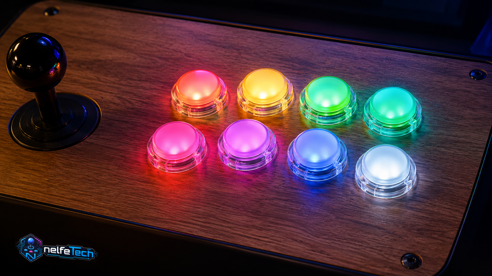

# Welcome

**LedManager** brings the buttons and LED panels of your cabinet to life, in sync with your RetroBat games: each game colors your buttons according to its real controls, MAME lamps light up just like on the original cabinet, and effects react in real time to what happens on screen.



## What LedManager does

- **Per-game panels**: when you select a game, your buttons take the colors of the game's real controls (provided by APIExpose).
- **MAME arcade lamps**: native outputs (`READY_LAMP`, `TORP_LAMP_1`…) light up the right buttons, just like the original cabinet.
- **In-game effects**: flashes, Start/Select pulses, live scores on LED matrices, reactions to game events.
- **Open hardware**: a ready-to-build Raspberry Pi Pico setup (wiring diagram included), adaptable to other LED boards (PacLED64, LED-Wiz, WLED…).

## Where to start?

<div class="grid cards" markdown>

- **[Getting started](premiers-pas.md)** — install LedManager in 5 minutes.
- **[Hardware](materiel.md)** — wire your Raspberry Pi Pico and flash the firmware.
- **[Configuration](configuration.md)** — describe your panel in the `.ini` files.
- **[Troubleshooting](depannage.md)** — solutions to common issues.

</div>

!!! tip "Prefer to wire everything first?"
    Start with the [Hardware](materiel.md) page: once the Pico is wired and flashed, the software install only takes a few minutes.

## How it works

```text
APIExpose (game events)
   → LedManager.exe (decides what to display)
      → generic commands (SLOT 1 RED, FLASH 6 YELLOW 80…)
         → PicoCommandSender.exe (adapts to your hardware)
            → Raspberry Pi Pico → your LEDs
```

LedManager is part of the RetroBat plugin family together with [APIExpose](https://github.com/Nelfe80/RetroBat-APIExpose) (the data engine, **required**) and [MarqueeManager](https://github.com/Nelfe80/RetroBat-Marquee-Manager) (marquee screens and DMD).
