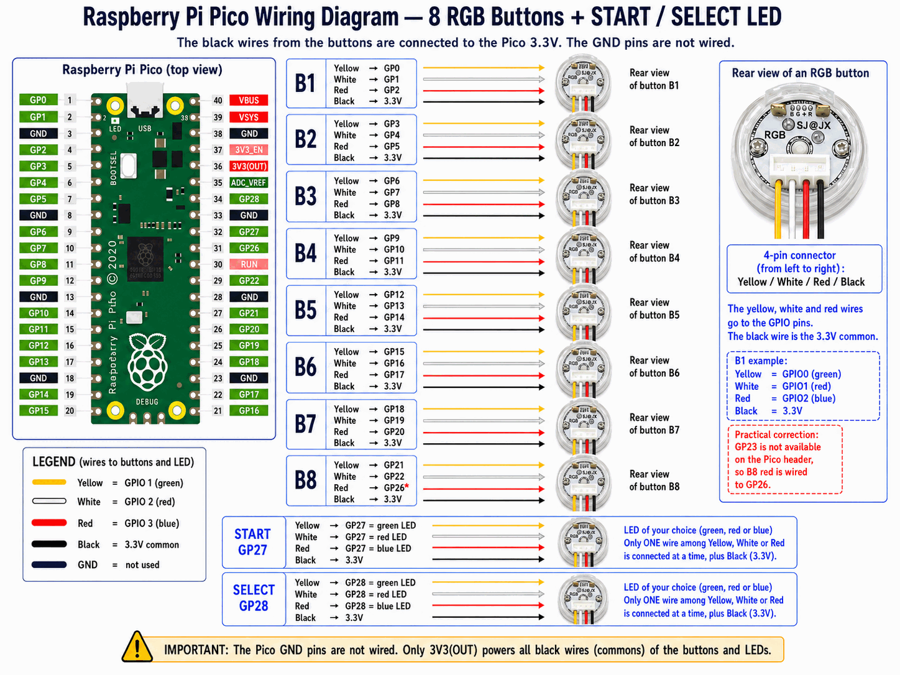

# Hardware

The reference build uses a **Raspberry Pi Pico** driving 8 RGB buttons plus START/SELECT LEDs. It is the best-supported hardware; for other boards, see [External LED boards](cartes-externes.md).

## Wiring



Key points of the diagram:

- Each RGB button uses **3 GPIOs** (yellow, white, red wires): B1 = GP0/GP1/GP2, B2 = GP3/GP4/GP5, and so on.
- The **black** wire of each button is the common, connected to the Pico's **3.3V** — GND pins are not wired.
- **START** uses GP27 and **SELECT** GP28, with a simple LED (only one of the three color wires connected, your choice).
- Special case: GP23 is not available on the connector, so B8's red is wired to **GP26**.

!!! warning "Important"
    Only **3V3(OUT)** powers the buttons' and LEDs' common wires. Do not wire the Pico's GND pins to the buttons.

## Flashing the firmware

The Pico firmware ships in the plugin's `fw\` folder. To deploy it:

```powershell
powershell -NoProfile -ExecutionPolicy RemoteSigned -File tools\deploy-pico-fw.ps1
```

The script copies `main.py`, `profiles_db.py` and `hardware_profiles.py` onto the Pico (MicroPython required). If the Pico misbehaves, `tools\reset-pico.ps1` forces a clean restart.

## Checking the Pico

The firmware answers two diagnostic commands over serial (115200 bauds):

```text
VERSION  →  VERSION DYNAMIC_PANEL_ADDR 2026.06.20
CAPS     →  CAPS PING,INIT,PTR,BUS,HW,GPIO,SLOT,SLOTPWM,...
```

It is the fastest way to confirm the firmware is present and up to date before blaming the configuration.

## Describing your panel

Once the hardware is wired, describe it **in plain words** in `PicoCommandSender.ini` — button count, LED type, GPIOs used:

```ini
[Hardware:P1]
PanelButtons=8
PanelButtonType=RGBLED
Start=LED
Select=LED

[GPIO:P1]
B1=0,1,2
B2=3,4,5
START=27
SELECT=28
```

Available types: `NONE` (absent), `LED` (simple ON/OFF, 1 GPIO), `RGBLED` (3 GPIOs), `ADDRLED` (addressable WS2812/NeoPixel). The sender handles all firmware initialization — you never need to know an internal profile name.

The rest of the configuration (routing, colors, serial port) is covered in [Configuration](configuration.md).
