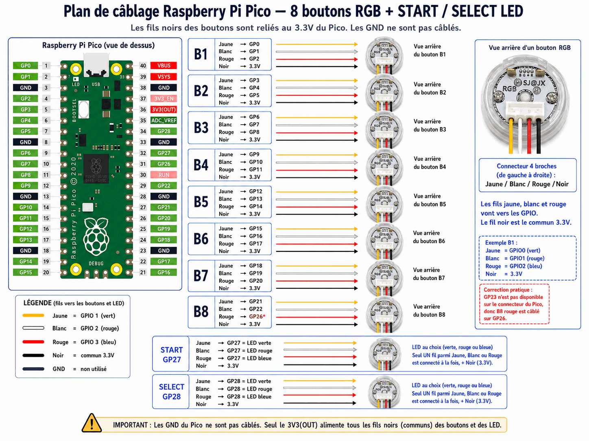
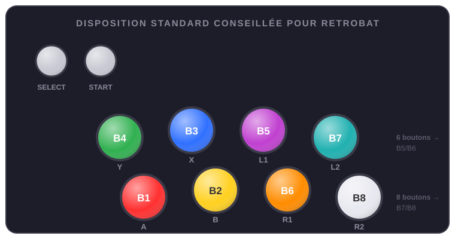

# Matériel

Le montage de référence utilise un **Raspberry Pi Pico** qui pilote 8 boutons RGB et des LED START/SELECT. C'est le matériel le mieux supporté ; pour d'autres cartes, voir [Cartes LED externes](cartes-externes.md).

## La liste des composants

Le kit de référence, **sans aucune soudure** (détail complet dans `resources\setup\kits\default.json`) :

| Composant | Qté | Rôle |
|---|---|---|
| Raspberry Pi Pico **H** | 1 | Contrôleur des LED (la version H évite la soudure) |
| Carte d'extension GPIO (breakout type Freenove) | 1 | Accès sans soudure aux GPIO et au 3V3 |
| Boutons arcade RGB 4 fils (SJ@JX / SAJAX) | 8 | Boutons principaux, RGB complets (3 GPIO chacun) |
| Boutons RGB utilisés en couleur fixe | 2 | START et SELECT (1 seul fil couleur câblé) |
| Connecteurs Dupont → XH2.54 4P | 10 | Un par bouton, connexion sans soudure |
| Bloc Dupont 2,54 mm pour le commun | 1 | Distribue le 3V3(OUT) vers les 10 boutons |
| Câble **micro-USB data** | 1 | Communication + alimentation (pas un câble de charge seul !) |
| Joystick arcade + carte USB d'entrées | 1+1 | Les **entrées** de jeu — carte au choix (Zero Delay, DragonRise, I-PAC…), LedManager n'y touche pas |

Recommandé en plus : des câbles Dupont de rechange, des **étiquettes** pour repérer B1–B8 et les canaux couleur, des serre-câbles ; en option un multimètre et une alimentation 5 V externe si l'USB ne suffit pas à pleine luminosité.

## Le câblage



Les points essentiels du plan :

- Chaque bouton RGB utilise **3 GPIO** (fils jaune, blanc, rouge) : B1 = GP0/GP1/GP2, B2 = GP3/GP4/GP5, et ainsi de suite.
- Le fil **noir** de chaque bouton est le commun, relié au **3.3V** du Pico — les GND ne sont pas câblés.
- **START** utilise GP27 et **SELECT** GP28, avec une LED simple (une seule couleur parmi les trois fils, au choix).
- Cas particulier : GP23 n'étant pas disponible sur le connecteur, le rouge de B8 est câblé sur **GP26**.

!!! warning "Important"
    Seul le **3V3(OUT)** alimente les fils communs des boutons et LED. Ne câblez pas les GND du Pico vers les boutons.

## La disposition standard conseillée pour RetroBat

Placez physiquement vos boutons selon cette disposition — c'est elle qu'attendent les panels par jeu du Data Pack :



```text
SELECT   START

 B4·Y    B3·X    B5·L1    B7·L2
 B1·A    B2·B    B6·R1    B8·R2
```

Sa force : elle reste **fonctionnelle de 2 à 8 boutons sans recâblage**, car chaque bouton garde son identité. Un panel 2 boutons = `B1 B2` ; en 4 boutons on ajoute la rangée du haut `B4 B3` ; en 6 on ajoute la colonne `B5/B6` (L1/R1) ; en 8 la colonne `B7/B8` (L2/R2). Agrandir son panel n'oblige jamais à déplacer un bouton existant, et les couleurs par jeu tombent toujours au bon endroit.

`SELECT` puis `START` se placent en haut à gauche du panel. Cette disposition est décrite dans `resources\setup\layouts\retrobat_standard.json` — c'est elle que le panel virtuel de `LedManagerSetup.exe` affiche.

!!! note "Le Setup Manager pendant une partie"
    Le panel virtuel tourne volontairement en priorité basse et regroupe ses rafraîchissements pour peser le moins possible. Un léger ralentissement du jeu reste néanmoins possible quand la fenêtre est ouverte pendant une partie — c'est normal : c'est un outil de mise au point, fermez-le pour jouer sérieusement.

## Flasher le firmware

Le firmware du Pico est fourni dans le dossier `fw\` du plugin. Pour le déployer :

```powershell
powershell -NoProfile -ExecutionPolicy RemoteSigned -File tools\deploy-pico-fw.ps1
```

Le script copie `main.py`, `profiles_db.py` et `hardware_profiles.py` sur le Pico (MicroPython requis). En cas de Pico récalcitrant, `tools\reset-pico.ps1` force un redémarrage propre.

## Vérifier le Pico

Le firmware répond à deux commandes de diagnostic sur le port série (115200 bauds) :

```text
VERSION  →  VERSION DYNAMIC_PANEL_ADDR 2026.06.20
CAPS     →  CAPS PING,INIT,PTR,BUS,HW,GPIO,SLOT,SLOTPWM,...
```

C'est le moyen le plus rapide de confirmer que le firmware est en place et à la bonne version avant d'accuser la configuration.

## Décrire votre panel

Une fois le matériel branché, vous le décrivez **avec des mots simples** dans `PicoCommandSender.ini` — nombre de boutons, type de LED, GPIO utilisés :

```ini
[Hardware:P1]
PanelButtons=8
PanelButtonType=RGBLED
Start=LED
Select=LED

[GPIO:P1]
B1=0,1,2
B2=3,4,5
START=27
SELECT=28
```

Types possibles : `NONE` (absent), `LED` (simple ON/OFF, 1 GPIO), `RGBLED` (3 GPIO), `ADDRLED` (WS2812/NeoPixel adressable). Le sender se charge de toute l'initialisation du firmware — vous n'avez aucun nom de profil interne à connaître.

La suite de la configuration (routage, couleurs, port série) est détaillée dans [Configuration](configuration.md).
