# Panels par système

Chaque système RetroBat a sa configuration de couleurs, issue d'un vrai contrôleur ou stick arcade
d'époque (Score Master, Fighting Stick, sticks NEOGEO…) — voir la [recherche d'origine sur le forum
RetroBat](https://retrobat.forumgaming.fr/t2953-led-panel-manager-panels-arcades-couleurs-des-boutons-led-lip).
C'est ce que vos boutons LED affichent quand vous sélectionnez un jeu du système. Quand un système
propose plusieurs panels historiques, chaque variante est illustrée ; elle se choisit dans le menu
EmulationStation du système (réglage « Panel »).

Les positions suivent la [disposition standard](materiel.md) : SELECT/START en haut à gauche,
rangée haute B4 B3 B5 B7, rangée basse B1 B2 B6 B8. Sous chaque bouton figure la **fonction
d'origine du système** (Circle, Triangle, A, B, C…) ; les boutons estompés ne sont pas utilisés
par ce panel.

## 3do

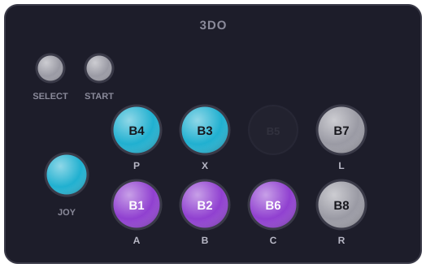

## amiga1200

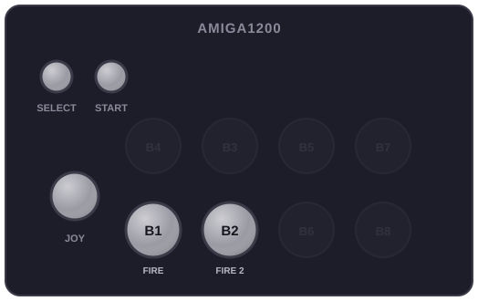

## amiga500

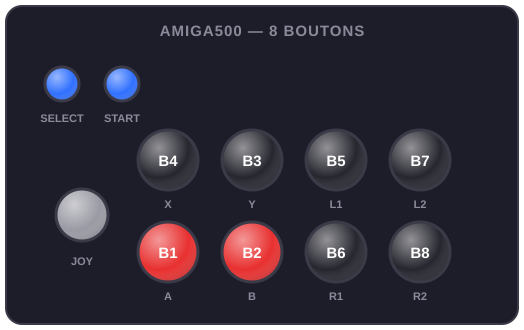

## amiga600

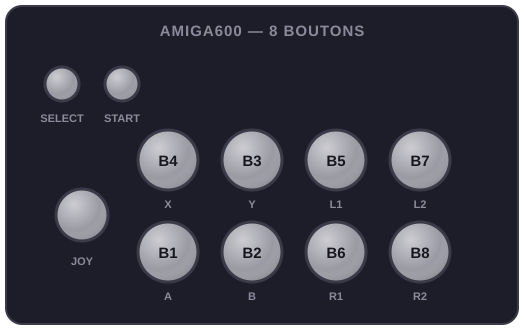

## amigacd32

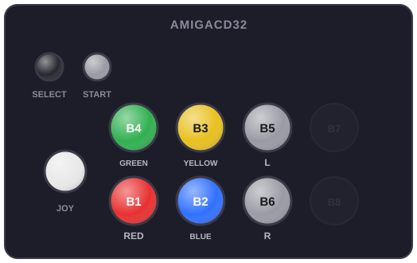

## amstradcpc

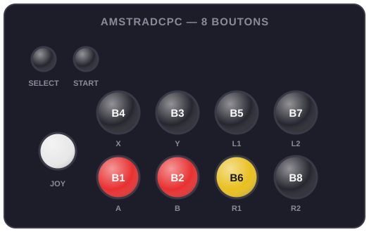

## apple2

## apple2gs

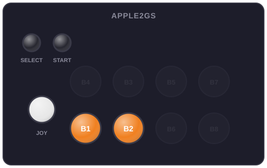

## atari2600

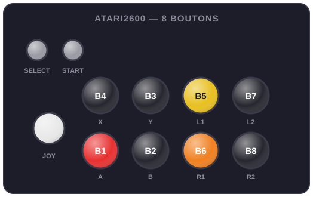

## atari5200

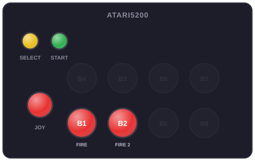

## atari7800

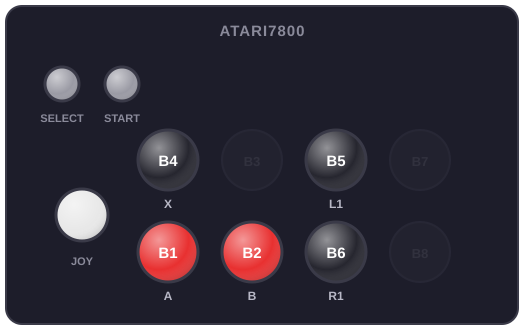

## atari800

## atarist

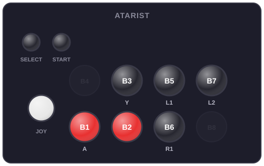

## atomiswave

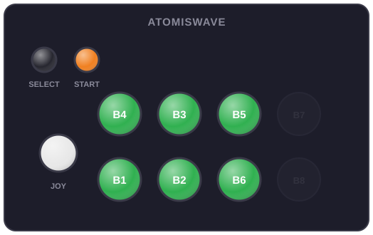

## bandaiwonderswan

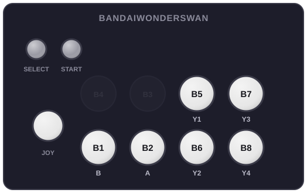

## bbcmicro

## c64

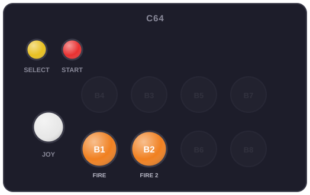

## cdi

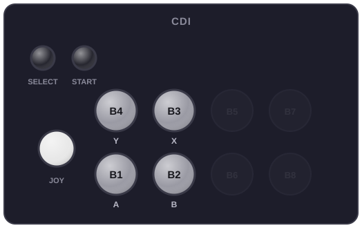

## colecovision

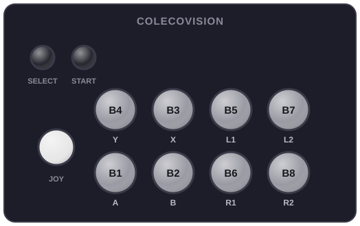

## dreamcast

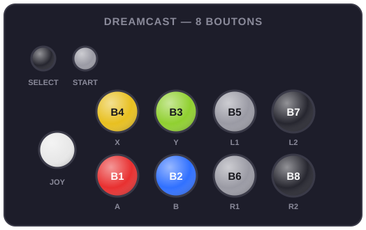

### HKT-7300

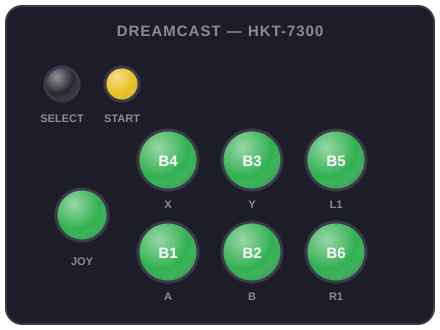

## fds

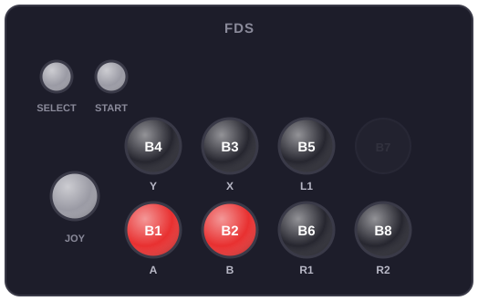

## gamecube

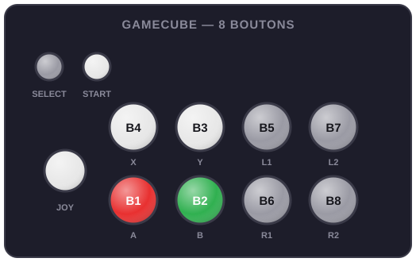

### Fighting Stick Cube

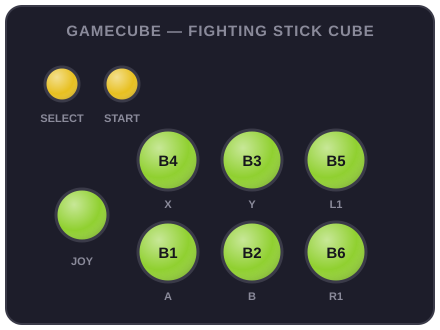

### Left Stick

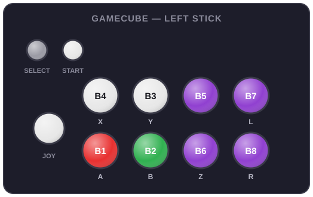

### Yellow Stick

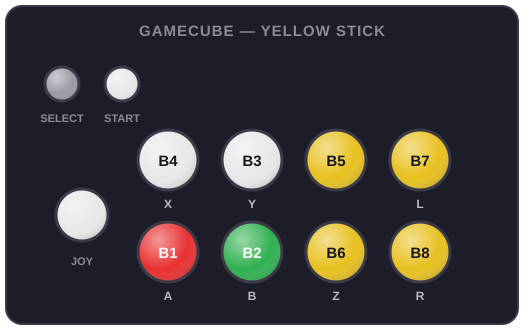

## gamegear

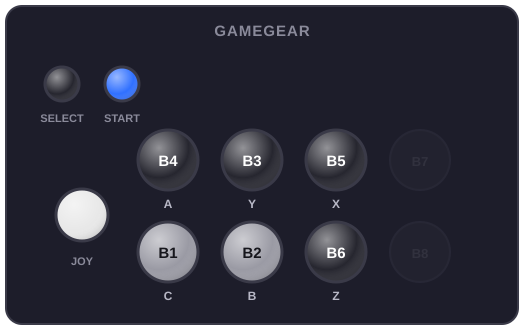

## gb

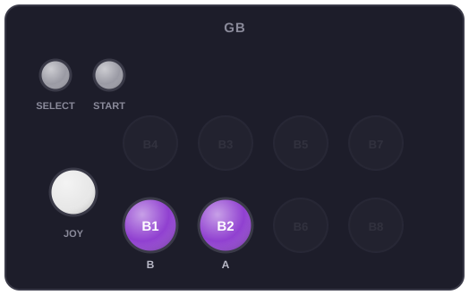

## gba

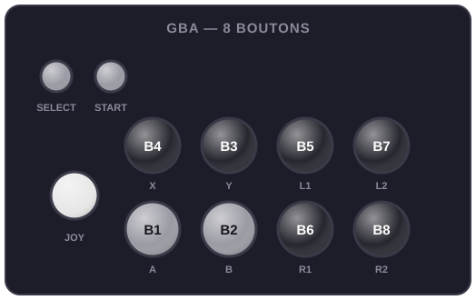

## gbc

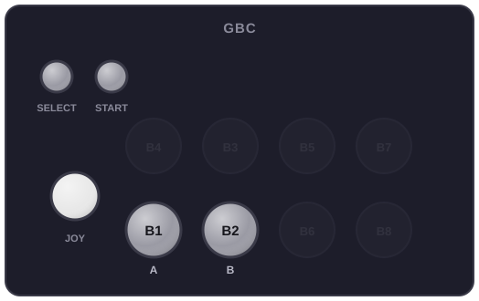

## gx4000

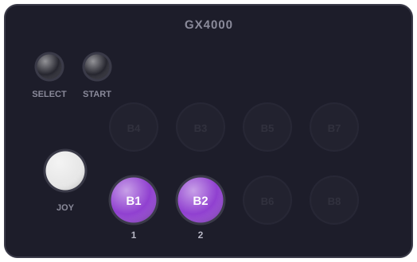

## jaguar

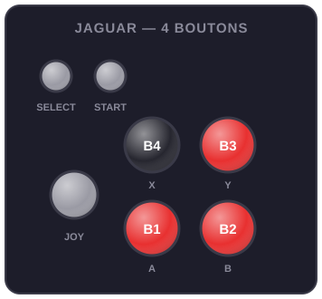

### Jaguar Controller

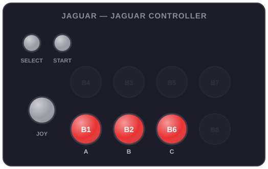

### Jaguar Pro Controller

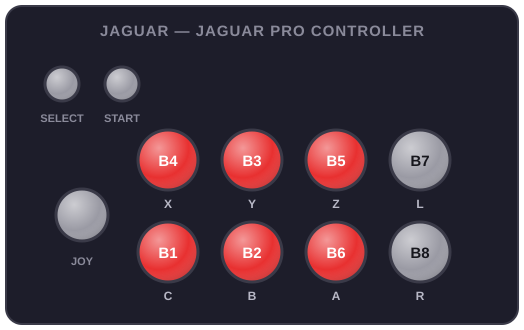

## lynx

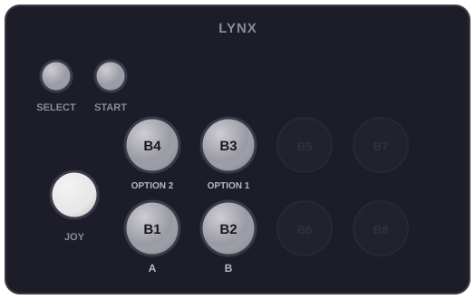

## mame

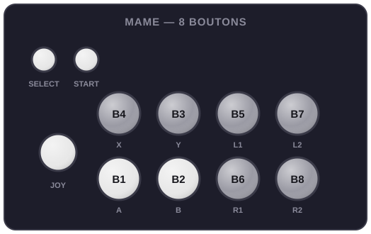

## mastersystem

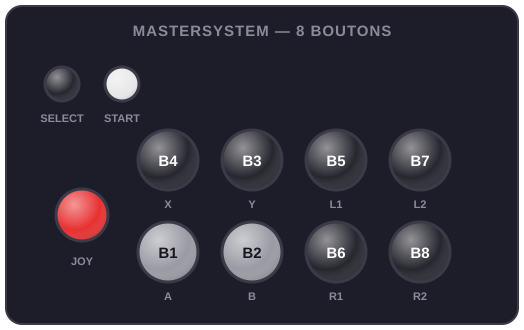

## megadrive

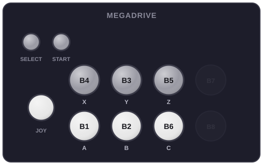

### Arcade Power Stick II

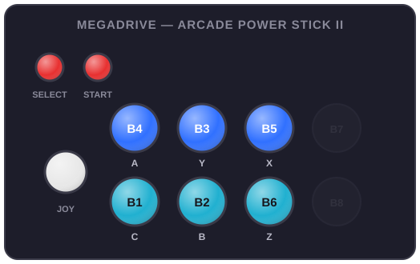

## megaduck

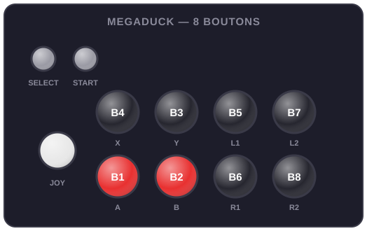

## msx1

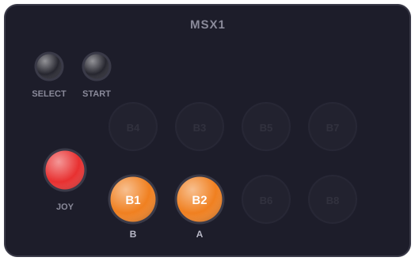

## multivision

## n64

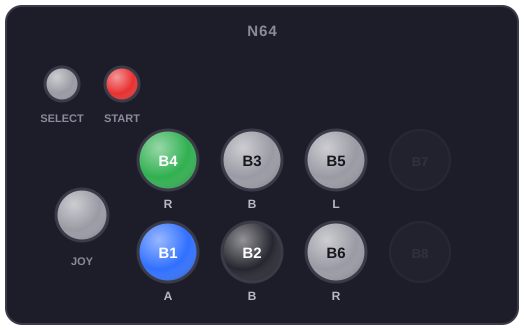

### Arcade-Shark 6B

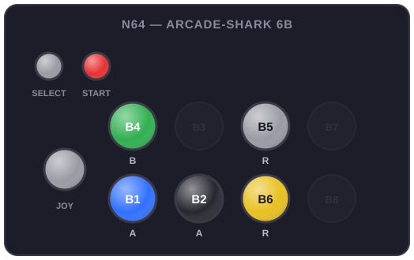

### Arcade-Shark 8B

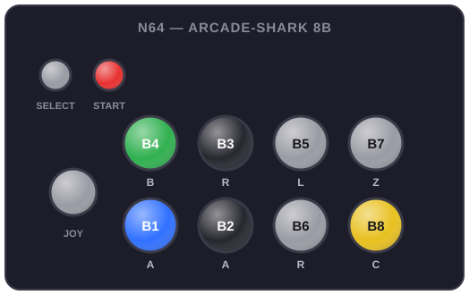

### Arcade-Shark Yellow Mode

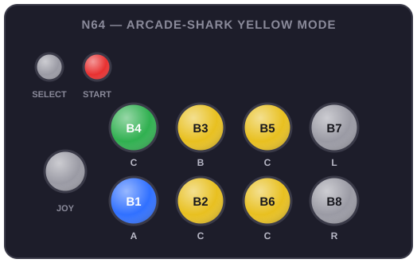

## naomi

## naomigd

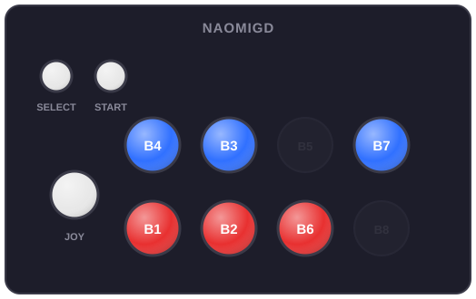

## nds

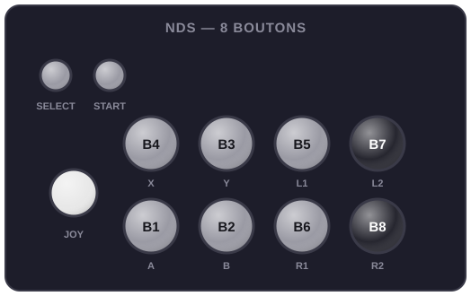

## neogeo

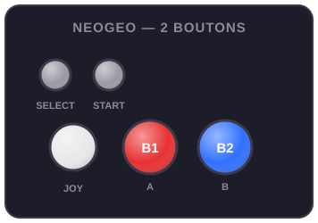

### NEOGEO MINI

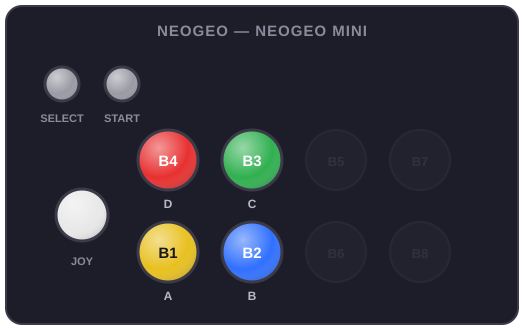

### NEOGEO VARIATION

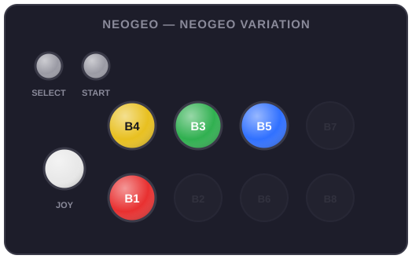

### NEOGEO MVS TYPE 1

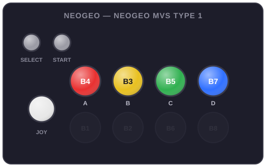

### NEOGEO MVS TYPE 1 - VARIATION

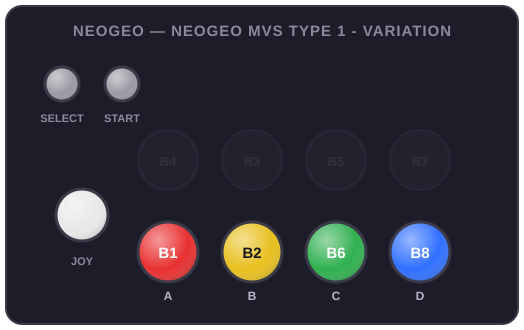

### NEOGEO MVS TYPE 2

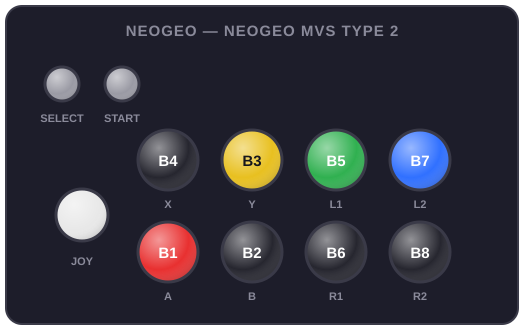

## neogeocd

## nes

## ngp

## ngpc

## oricatmos

## pcengine

## pcenginecd

## pcfx

## pokemini

## ps2

## psp

## psx

## samcoupe

## satellaview

## saturn

### Virtual Stick 6B

### Virtual Stick 8B

## scummvm

## scv

## sega32x

## segacd

## sg1000

## snes

### Score Master

### Super Advantage

### Super Advantage - 8B

## spectravideo

## sufami

## supergrafx

## supervision

## thomson

## ti994a

## tic80

## trs80coco

## uzebox

## vectrex

## vg5000

## vic20

## videopacplus

## virtualboy

## wii

## wswan

## wswanc

## x1

## x68000

## xbox

## xbox360

## zx81

## zxspectrum

